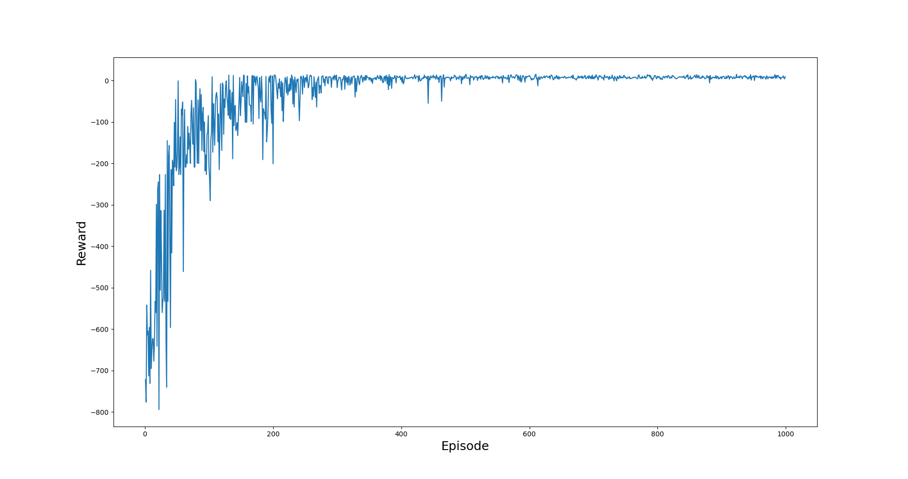

<h2>Implemented SARSA algorithm on Taxi-V3 which is an OPENAI gym environment.</h2>
 
<h3>Hyperparameters:</h3>
<ul>
    <li>Episodes - 500</li>
    <li>Trajectory length - 500</li>
    <li>Learning rate - 0.3</li>
    <li>Gamma - 0.8</li>
    <li>Initial epsilon - 1</li>
    <li>Epsilon decay function - 1/episode_number</li>
</ul>
 

