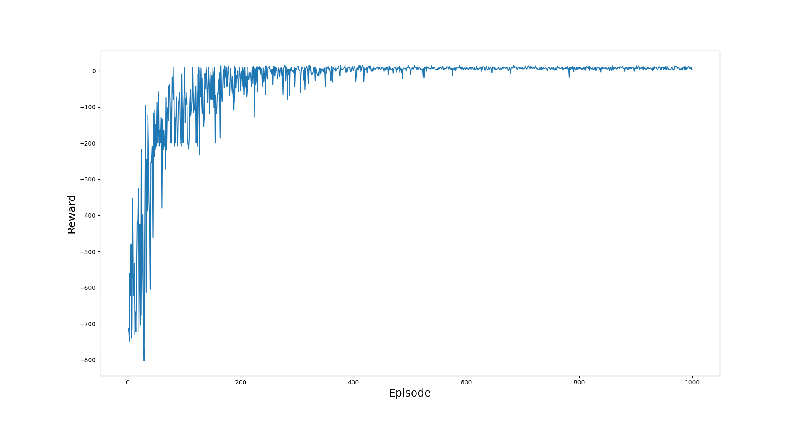
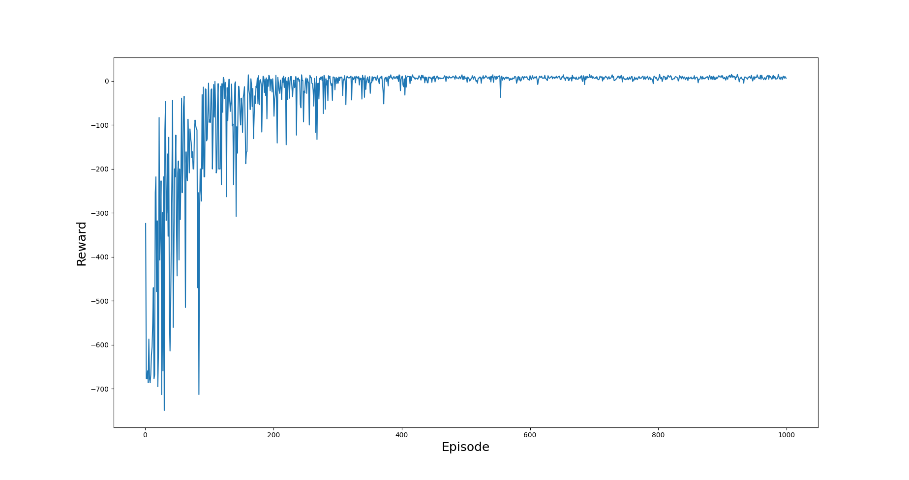
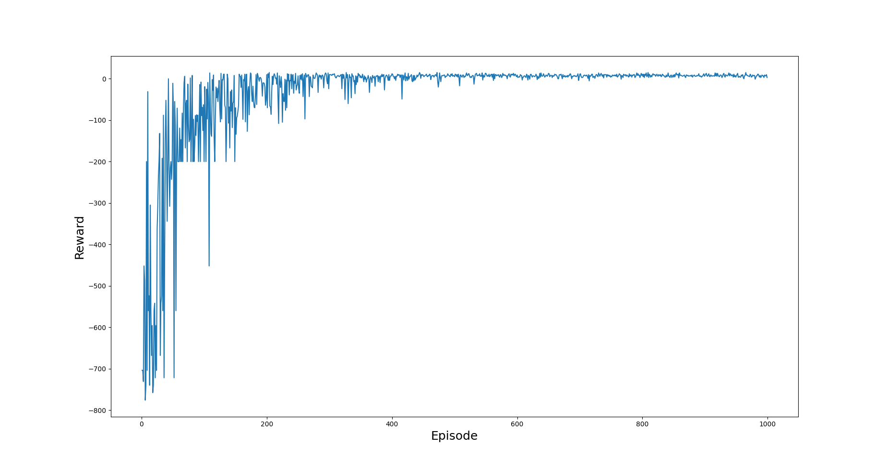
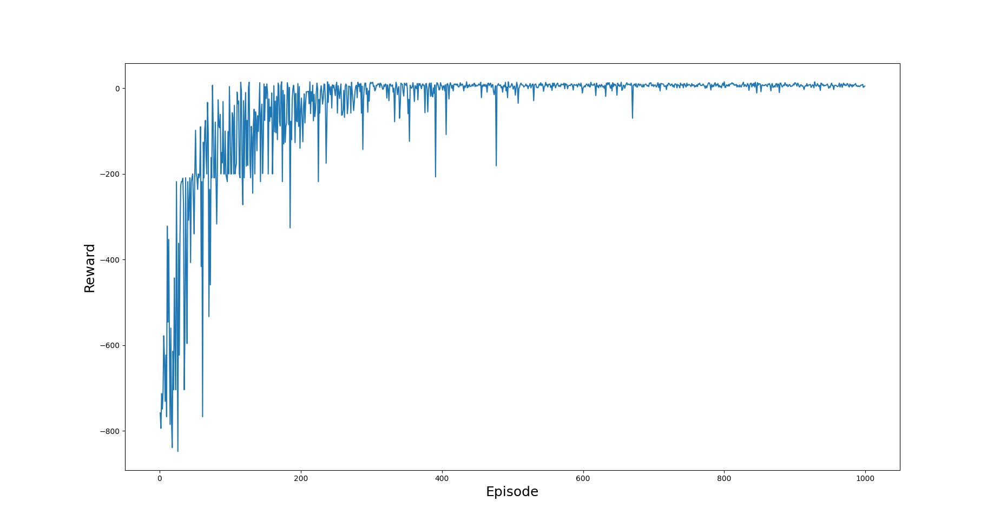

<h1>Implemented SARSA and Q-learning on Taxi-V3 which is an OPENAI gym environment.</h1>
 
<h2>Hyperparameters:</h2>
<ul>
    <li>Episodes - 500</li>
    <li>Trajectory length - 500</li>
    <li>Learning rate - 0.6</li>
    <li>Gamma - 0.9</li>
    <li>Initial epsilon - 1</li>
    <li>Epsilon decay function - 1/episode_number</li>
</ul>
 

<h2>SARSA</h2>

 

<h2>SARSA with replace traces</h2>

 

<h2>SARSA with accumulate traces</h2>

 

<h2>Q-Learning</h2>

 

<h2>Q-Learning with replace traces</h2>

 

<h2>Q-Learning with accumulate traces</h2>

